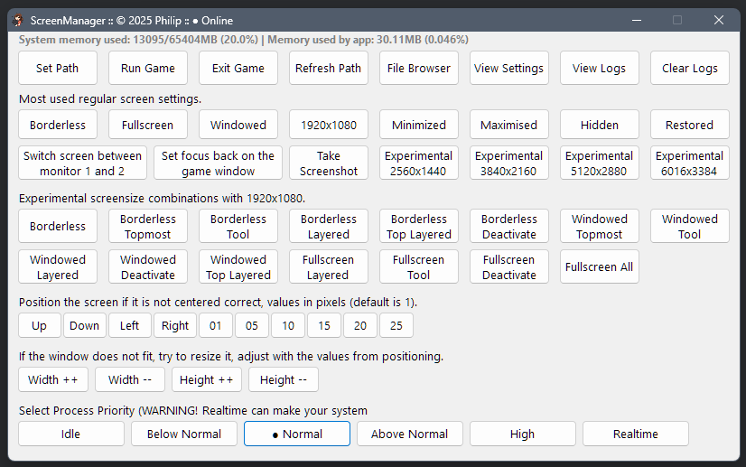

# Screen Manager for Silent Hill f

Silent Hill f is run with a bat file, this is a special version based on that.    

#### Instructions:
Place this .exe in the directory of the game .exe.                  
Then click Set Path and when done click Run Game.                   

Features:
- move screen to another monitor.
- full screen.
- borderless.
- 1920x1080.
- windowed mode.
- reposition.
- resize.
- screenshot.
- run game.
- exit game.
- change process priority.
- and more...

With the combination of positioning and resizing you can achieve a perfect full screen window.                             
Check the settings folder for the (JConfig) screen settings.     
Some games have phantom screens (sometimes more then 1, for example Dead or Alive 5), just click "Windowed" and close those screens.                
Eventually the game window becomes main and you can adjust it.

Other sizes available for test purposes, examples:                    

| #   | Name                    | Screen Resolution | Browser Viewport     | 
|-----|-------------------------|-------------------|----------------------|
| 1️⃣ | **Full HD (FHD)**       | **1920 × 1080**   | **≈ 1536 × 754 px**  | 
| 2️⃣ | **Quad HD (QHD / 2K)**  | **2560 × 1440**   | **≈ 2304 × 1216 px** | 
| 3️⃣ | **4K Ultra HD (UHD)**   | **3840 × 2160**   | **≈ 3200 × 1728 px** | 
| 4️⃣ | **5K**                  | **5120 × 2880**   | **≈ 4480 × 2592 px** | 
| 5️⃣ | **6K**                  | **6016 × 3384**   | **≈ 5376 × 3096 px** | 
| 6️⃣ | **8K Ultra HD (UHD-2)** | **7680 × 4320**   | **≈ 7040 × 4032 px** | 

## Common Window Modes (High-Level, User-Facing)

| #   | Mode           | Description                                                                        | Notes                                  |
|-----|----------------|------------------------------------------------------------------------------------|----------------------------------------|
| 1️⃣ | **Fullscreen** | **Covers the entire screen, often exclusive mode for games.**                      | **Usually removes borders/title bar.** |
| 2️⃣ | **Windowed**   | **Standard resizable window with title bar and borders.**                          | **Can be moved, resized.**             |
| 3️⃣ | **Borderless** | **Windowed Fullscreen	Looks fullscreen but technically a window without borders.** | **Easier alt-tabbing.**                |
| 4️⃣ | **Hidden**     | **Window exists but is invisible.**                                                | **Uses SW_HIDE.**                      |

## Window States (WinAPI / How Windows Manages Visibility)

| #   | State                 | WinAPI constant                             | Description                                         |
|-----|-----------------------|---------------------------------------------|-----------------------------------------------------|
| 1️⃣ | **Normal / Restored** | **SW_SHOWNORMAL / SW_RESTORE**              | **Standard window size, not minimized/maximized.**  |
| 2️⃣ | **Minimized**         | **SW_MINIMIZE**                             | **Shrunk to taskbar; can still receive messages.**  |
| 3️⃣ | **Maximized**         | **SW_SHOWMAXIMIZED**                        | **Easier alt-tabbing.**                             |
| 4️⃣ | **Hidden**            | **SW_HIDE**                                 | **Window exists but invisible.**                    |
| 5️⃣ | **Shown / Activated** | **SW_SHOW / SW_SHOWNA / SW_SHOWNOACTIVATE** | **Fills the screen but retains borders/title bar.** | 

---

      

**[RobertoTorino](https://github.com/RobertoTorino)**                     
